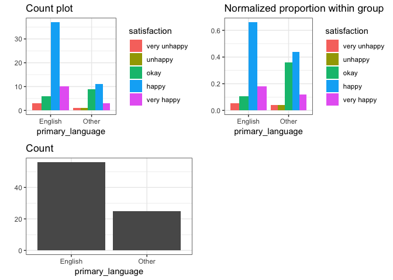

Milestone 2: EDA for Survey Results
================

Survey Design:
--------------

We designed our survey based on our proposal: [MDS Program Satisfaction Survey](https://docs.google.com/forms/d/e/1FAIpQLSen3J_qhrALM8JovRQPo0KoHIKeoBqauHTrYQbwaC0DM8XFfA/viewform). The survey results were then collected imported into R using the google sheets library. EDA was performed based on each predictor.

> 1.  Count based grouped bar chart, which represents the direct count of number of people give specific response;
> 2.  Proportion based grouped bar chat, which represents the normalized proportion for people with in each level of predictor, e.g. for all females or all males;
> 3.  Distribution of the predictor, which reflect the balance/unbalance of the collect data.

EDA: summarization, visualization and interpretation
----------------------------------------------------

(The source codes for data cleaning, preprocessing and visualization function design are not included in this report considering the report length. They can be accessed [here](Milestone_2_EDA.Rmd))

In order to facilitate our EDA, our original survey questions were converted to more computer friendly variable names. Below is the pairing:

> **sex:** Please select your sex
>
> **age:** Please select your age
>
> **satisfaction:** What is your level of satisfaction with the MDS program?
>
> **primary\_language:** What is your primary language of communication (in all forms of speaking, reading, writing)?
>
> **level\_education:** What is your highest level of education prior to MDS?
>
> **STEM:** Was your highest level of education prior to MDS - amongst the STEM (Science, Technology, Engineering and Mathematic) academic disciplines?
>
> **Years\_off\_school:** How many years ago did you attain your highest level of education prior to MDS?

Our data, for the analysis, contains only categorical data. The summary table below showcases the counts of each category of every categorical variable.

### Summary Table

``` r
data %>% summary()
```

    ##      sex        age           satisfaction primary_language
    ##  Female:34   21-25:36   very unhappy: 4    English:56      
    ##  Male  :44   26-30:31   unhappy     : 1    Other  :25      
    ##  Others: 3   31-35: 7   okay        :15                    
    ##              35+  : 7   happy       :48                    
    ##                         very happy  :13                    
    ##   level_education  STEM    Years_off_school
    ##  Bachelors:64     No :15   0-2 :34         
    ##  Masters+ :17     Yes:66   3-5 :30         
    ##                            5-10:11         
    ##                            10+ : 6         
    ## 

Sex
---

``` r
Visualization(data, "sex")
```

    ## Joining, by = "predictor"


**Interpretation**:
The bar charts above illustrate a few things. The number of Male to Female candidates were close to even, with 3 candidates choosing NA, other, or not to answer. These 3 have been grouped together as "others". A vast majority of the candidates of both Male and Female sex selected "happy" as their satisfaction level. Approximately 95% of the "Female" candidates appear to have selected okay or higher on the satisfaction level, while approximately 93% of the "Male" candidates exhibited the same behaviour. There does not seem to be much of difference in program satisfaction between sexes.

Age
---

``` r
Visualization(data, "age")
```

    ## Joining, by = "predictor"


**Interpretation**:
The count plot indicates that the student base at MDS is certainly leaning towards the younger side. However, the normalized proportions of satisfaction show that all age groups are enjoying the program. Interestingly, the age-group of 26-30 has the most number of "very happy" candidates both proportionally and as an over all count, while none of the 21-25 year old candidates selected "very happy" in spite of being the largest group.

Years Away from School
----------------------

``` r
Visualization(data, "Years_off_school")
```

    ## Joining, by = "predictor"


**Interpretation**:
Most students at MDS seem to have been away from school for less than 5 years, with a handful having been away for more than a decade. Interestingly, these candidates that have been away from school for 10+ years seem to bee quite satisfied with MDS, and their return back to school, since all of them have rated their satisfaction as happy or very happy. It could be said the 10+ year group is more satisfied than all other groups. However, due to the scarcity of data, it would be a bold move to generalize like that.

Primary Language
----------------

``` r
Visualization(data,'primary_language')
```

    ## Joining, by = "predictor"



**Interpretation**: The count plot above shows that there are 2 times as many native english speakers, than there are people with a primary language other than english. Amongst the candidates that selected english as their primary language, more than 60% of them feel happy about the MDS program. Both groups showcase a variation in satisfaction levels, however, most of the people - in both groups - seem to be be happy with program; less than 5% in each group rated their satisfaction with MDS as unhappy or very unhappy. Interestingly, however, candidates that said english was not their primary language had a larger proportion of people that had a neutral "okay" satisfaction with the MDS program.

Level of Education
------------------

``` r
Visualization(data,'level_education')
```

    ## Joining, by = "predictor"


**Interpretation**:
The bar plot above shows that approximately 75% of the students had completed a Bachelors degree prior to joining MDS, while the remaining had completed a Masters degree or higher. 60% of the students of each of the two groups are happy with this program, and most of the other proportions of satisfactory levels look even across both groups. It doesn't seem like the level of prior education had an impact on the candidates satisfaction level.
