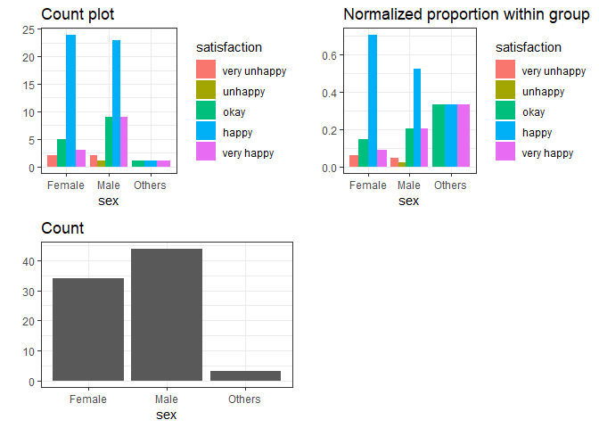
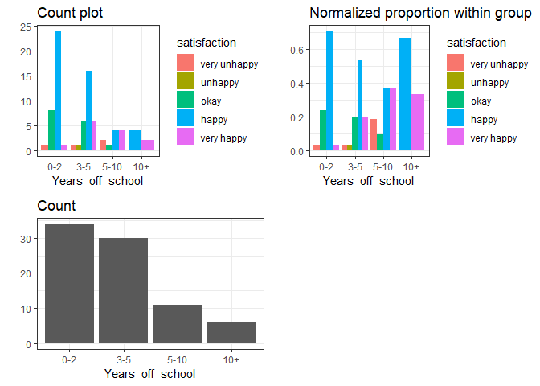
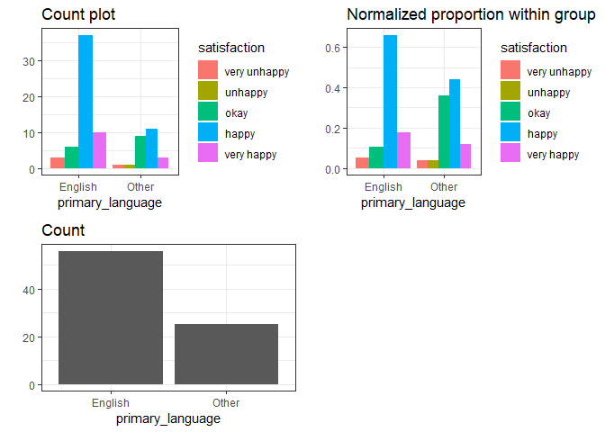
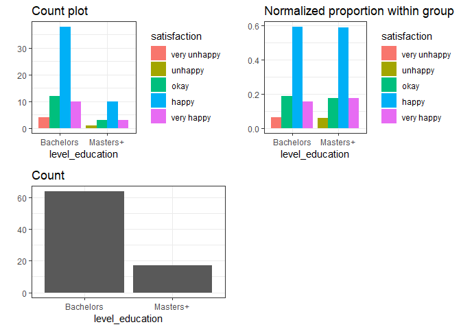

Milestone 2: EDA for Survey Results
================

Survey Design:
--------------

We designed our survey based on our proposal: [MDS Program Satisfaction Survey](https://docs.google.com/forms/d/e/1FAIpQLSen3J_qhrALM8JovRQPo0KoHIKeoBqauHTrYQbwaC0DM8XFfA/viewform). The survey results were then collected automatically and EDAs were performed based on each predictor. The will be three different plot for the EDA:

> 1.  Count based grouped bar chart, which represents the direct count of number of people give specific response;
> 2.  Proportion based grouped bar chat, which represents the normalized proportion for people with in each level of predictor, e.g. for all females or all males;
> 3.  Distribution of the predictor, which reflect the balance/unbalance of the collect data.

EDA: visualization and interpretation
-------------------------------------

(The source codes for data cleaning, preprocessing and visualization function design are not included in this report considering the report length. They can be accessed [here](Milestone_2_EDA.Rmd))

### Summary Table

``` r
dimensions <- data %>% dim
cat(sprintf("Observations: %d\nFeatures: %d", dimensions[1], dimensions[2]))
```

    ## Observations: 81
    ## Features: 7

``` r
data %>% summary()
```

    ##      sex        age           satisfaction primary_language
    ##  Female:34   21-25:36   very unhappy: 4    English:56      
    ##  Male  :44   26-30:31   unhappy     : 1    Other  :25      
    ##  Others: 3   31-35: 7   okay        :15                    
    ##              35+  : 7   happy       :48                    
    ##                         very happy  :13                    
    ##   level_education  STEM    Years_off_school
    ##  Bachelors:64     No :15   0-2 :34         
    ##  Masters+ :17     Yes:66   3-5 :30         
    ##                            5-10:11         
    ##                            10+ : 6         
    ##

## Sex

``` r
Visualization(data, "sex")
```

    ## Joining, by = "predictor"

<!-- -->

**Interpretation**: There does not seem to be much difference in program
satisfaction between sexes. If a generalization had to be made, the vast
majority of females in the class are happy with the program while male
reponses are more varied.

## Age

``` r
Visualization(data, "age")
```

    ## Joining, by = "predictor"

<!-- -->

**Interpretation**: The overall determination grouping by age is that
all age groups seem to be happy with the program. In particular, those
over `35+` are very happy with the program.

## Years Away from School

``` r
Visualization(data, "Years_off_school")
```

    ## Joining, by = "predictor"

<!-- -->

**Interpretation**: Satisfaction seems to decrease then increase again.

## Primary Language

``` r
Visualization(data,'primary_language')
```

    ## Joining, by = "predictor"

<!-- -->

**Interpretation**: In this plot, it shows that the number of students
in MDS whose primary language are English is twice than the number of
students whose primary language are not English. For students whose
primary language is English, more than 60% of them feel happy about MDS
program, and some of them feel very happy and okay, and few of them feel
very unhappy. For students whose primary language is not English, most
of them feel happy and okay about MDS program, and few of them feel very
unhappy and unhappy.

## Level of Education

``` r
Visualization(data,'level_education')
```

    ## Joining, by = "predictor"

<!-- -->

**Interpretation**:

In this plot, 75% students’ education level in MDS program are Bachelors
and rest of them are Masters or higher. 60% of students of each two
groups are happy with this program. Some of them are okay and very happy
about MDS. Few of students whose education level are bachelors are very
unhappy and few of students whose education level are masters or higher
are unhappy.
